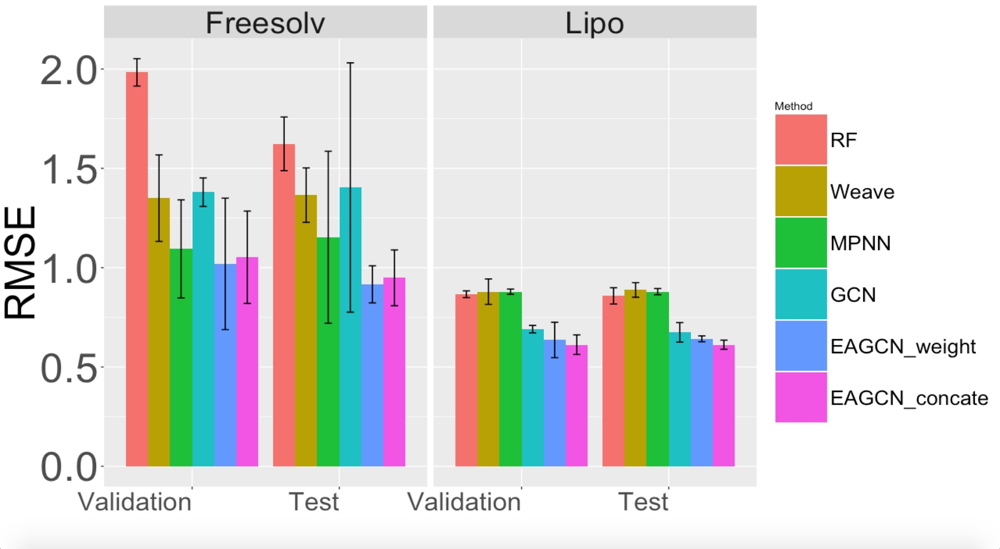
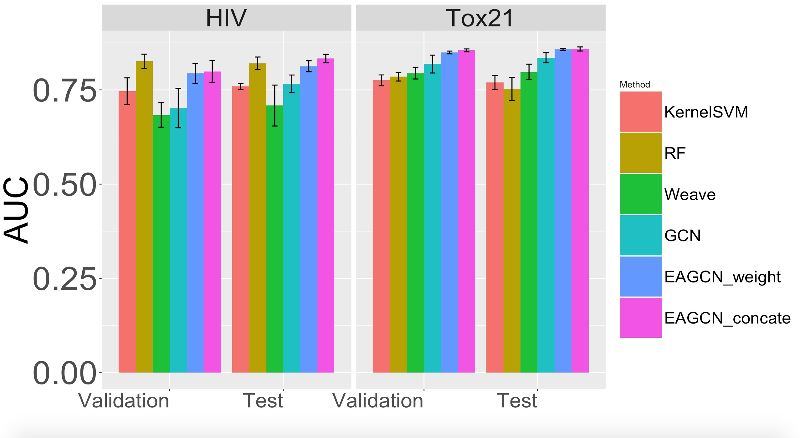

# EAGCN
This is a PyTorch implementation of the paper "Edge Attention based Multi-relational Graph Convolutional Networks", which is submitted to KDD 2018. 

## Installation

Install pytorch and torchvision. 

## EAGCN model

### Dataset

Four benchmark datasets ([Tox21, HIV, Freesolv and Lipophilicity](http://moleculenet.ai/datasets-1)) are utilized in this study to evaluate the predictive performance of built graph convolutional networks.  They are all downloaded from the [MoleculeNet](http://moleculenet.ai/) that hold various benchmark datasets for molecular machine learning.

### Train the model
When you train the model, you can tune the parameters in "options" folder.

    python train.py

### Test the model
    python test.py

## Model Structure
### Attention Layer:
Element Attention Machanism:

Graph Convolution:

## Experiment Result
Classification Performance on Tox21 Dataset

RMSE for Regression tasks on  Freesolv and Lipo:

ROC-AUC for Classification tasks on HIV and Tox21:

## Acknowledgments
Code is inspired by [GCN](https://github.com/tkipf/gcn) and [conv_qsar_fast](https://github.com/connorcoley/conv_qsar_fast)

